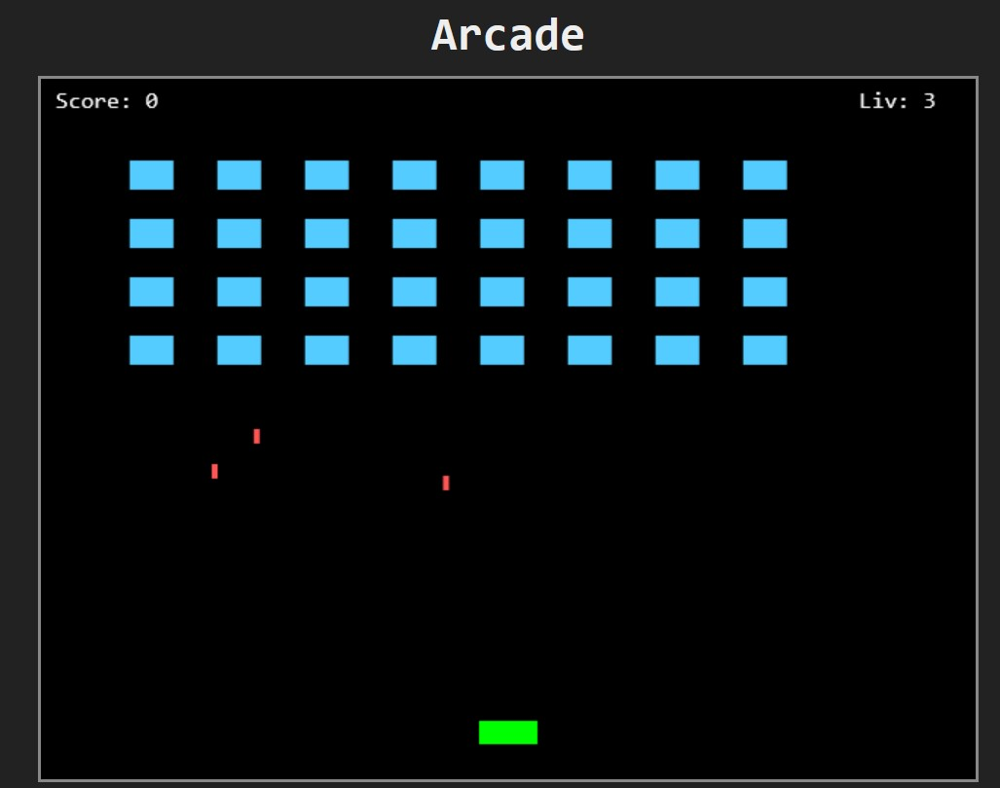

# Flask website with games.
<h4>A Flask game site generated by Claude.</h4>

A Flask website with access to 4 games  
(3 JS games and 1 Python game).  
 
The site was generated by <i>Claude</i>, in order to demonstrate  
creation of Flask sites using <i>Claude</i>.  
 
Steps:
<ul>
<li>Ask <i>Claude</i> for help setting up a Flask website.</li>
<li>Including <i>Static</i> and <i>Template</i> folder (with relevant content).</li>
<li>Then ask <i>Claude</i> for javascript games.</li>
<li>(and) game written in Python code.</li>
<li>Conclude by letting Claude download images,  and create
the full Flask website.</li>
</ul>
 
 
Original Flask <a href="https://github.com/SimonLaub/FlaskProject">website</a>.
